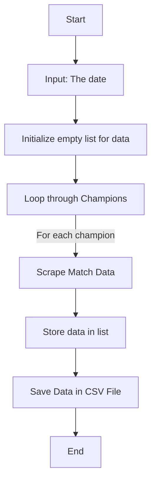

# Web Scraping with python

## Web Scraping Process: Fetching and Storing Data in CSV

## Packages
>
> - [requests](https://pypi.org/project/requests/)
>   - Requests allows you to send HTTP/1.1 requests extremely easily.
>
> - [BeautifulSoup](https://beautiful-soup-4.readthedocs.io/en/latest/)
>
> - lxml -parser ->  if you can, I recommend you install and use lxml for speed.
>
> - csv is a py lib
>
> - Pandas

## Description

> Developed a **Python** script using **Requests** and **BeautifulSoup** to scrape and save daily match details from **YallaCora** based on a user-specified date, exporting results into a **CSV** file using :
>
>1. **csv**
>
>2. **pandas**.

author: [Mohamed.8.Eleraqi](moamed.8.Eleraqi@gmail.com)
